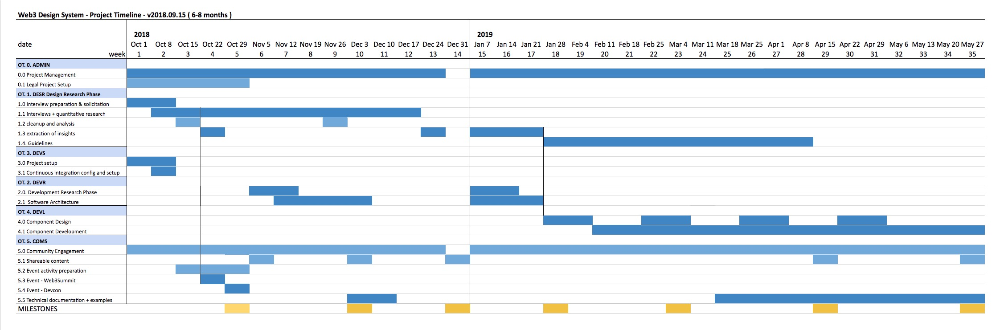

# Web3 Design System - Roadmap

the Web3 Design System proposes a research of the most common UX problems in the blockchain and Web3 space with the intention to develop a library of components that solve these problems. 
To do this, at a high level, we need to:

1. **Research**: interview designers, front-end developers, users etc to extract the biggest pain points of using and creating Dapps and gather information on current solutions being used 
1. **Analysis**: analyze and reduce the found data into an actionable list of insights and possibly components
1. **Development**: design and development of the most needed components and definition of best-practices guidelines.

The project is **scoped in time to ~6-8 months of commitments that fit the potential budget available** from Aragon and other granting organizations, but it is clear that it has **tasks that could continue after this time horizon**: 

 **In the first 6-8 months we will be able to design and develop only a few initial components and guidelines, but leaving all analysis and instructions for future things to implement** which us and/or other developers in the community could continue designing and developing.

The project has **different phases** (mainly Research and Development) each with it's own set of milestones. 
Some phases are **parallel and other sequential**.

This roadmap is a simplified version of the more detailed roadmap and milestones that are available in the **`full grant document.`** <!--TODO ADD LINK-->
We've created this simplification to clarify the granting timeline and deliverables.

## Summary of the Phases
- ADMIN - Administration Legal setup - 1 month
- **DESR - Design Research Phase - 3-5 months**
- **DEVR - Development Research Phase - 2-3 months**
- DEVS - Development Project Setup - 2-3 weeks
- **DEVL - Component Design and Development - 2-3 months**
(The exact timeline will be defined at the end of the DESR - Design Research and DEVR - Development Research phases)
- COMS - Communications and Community Participation (distributed over the whole project)

<!-- Less legible list with subtasks
## Summary of the Phases
- ADMIN - Administration Legal setup - 1 month
- **DESR - Design Research Phase - 3-5 months**
	- Interviews with designers and dapp developers
	- extraction of ​insights​ from the research
- **DEVR - Development Research Phase - 2-3 months**
	- research and define component architecture
- DEVS - Development Project Setup - 2-3 weeks
- **DEVL - Component Design and Development - 2-3 months**
(The exact timeline will be defined at the end of the DESR - Design Research and DEVR - Development Research phases)
	- design and development of components
	- testing the components and improving them
- COMS - Communications and Community Participation (distributed over the whole project)
-->

<!--TODO update timeline with the right one-->

[expand Timeline image](./Web3DesignLibrary_Timeline.jpg)

------
## Milestones & Deliverables
assuming the Project starts on the 1st of October 2018 (even if we have already started) we will try to give roughly one milestone per month to guarantee the continued funding of the project

### Milestone 1
month 1 - November 1 2018

- We have been selected for a talk at Devcon, to present the progress and initial insights of the research. The presentation will be our milestone 1, even if the research will not be finished yet.

### Milestone 2
month 2 - beginning of December 2018

- Research and interviews will still be happening but will not be over yet. We will write an article displaying the findings up to that moment, including the results from extra research performed at Devcon (we will also facilitate 2 other panels at Devcon, one on on-boarding and another on identities, and we will try to roll those results into the insights of the whole Web3 Design System) 

### Milestone 3
month 3 - end of December, beginning of January 2019

- The interviews will be mostly done and we would have started to do some analysis.
- We will publish an article with the initial thoughts and maybe give access to the cleaned interview notes.

### Milestone 4
month 4 - end of January, beginnig of February 2019

- The analysis will be complete and we will formalize a list of the most urgent problems and the initial list of components needed to tackle them, that we will implement in the next steps of the project

### Milestone 5
month 5 - beginning of March 2019

- Initial thoughts and content for the Guidelines
- some components designed and possibly developed
this is an internal release in the sense that, besides possible code on the repo, nothing of this will be published nor advertised yet

### Milestone 6
month 6.5 - mid April 2019

- Some initial guidelines will be published. We can't guarantee that all the guidelines will be filled with examples and explanations as these will be known only after the actual research phase. We commit to releasing some examples of how the guidelines should be imperatively constructed but leave margin for community comments and suggestions on them and also for completing them in future milestones. 

 

### Milestone 7
month 8 - end of May 2019

- Release and presentation of the first group of components that we will have been able to create in this timeframe.
- publication of "how to contribute" guidelines for developers and some examples on how to use the components in a dapp
- publication of all components and things that should be implemented in future phases of the project

