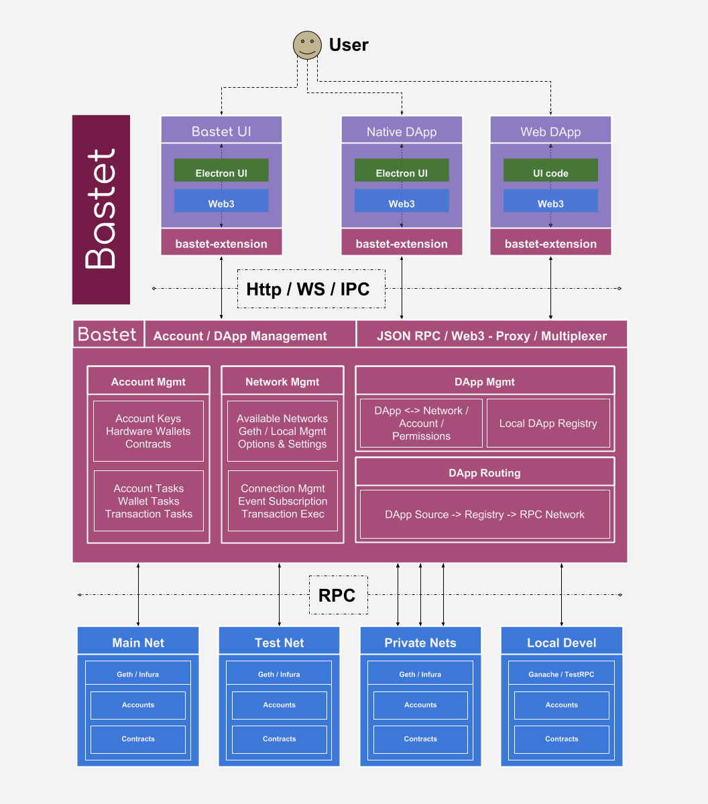

# Design Overview

### P.O.C.

Will demostrates a proof-of-concept for some of the proposal unknowns.

[link when repo made]

### High-level

Independent Golang application featuring:

A Single application binary with:

- Electron applicatoin for interacting with end-users
- `127.0.0.1:<known-port>` API server for DApps to talk to
- Installers for all platforms

### Flow

- DApp communicates with the signing-server on `127.0.0.1:<port>`
    - Enables flexible interaction for cross-browser support or other local applications
- On signing event
    - DApp -> local-signing-server (payload enough for signer to lookup)
    - signing-electorn-app -> user (UI notification)
    - user does thing in UI (signing / new app approve)
    - local-signing-server -> DAPP (optimistic success / error event)

### Some considerations

- How to have verified / approved DApps for the user?
- How to secure user machine communication?
    - Https sites __are__ allowed to talk to `127.0.0.1`
    - i.e. we need TLS between the DApp and OS-Signer
    - but... browsers may barf on a self-signed cert
    - Other local applications _should_ be easier to manage in this regard

